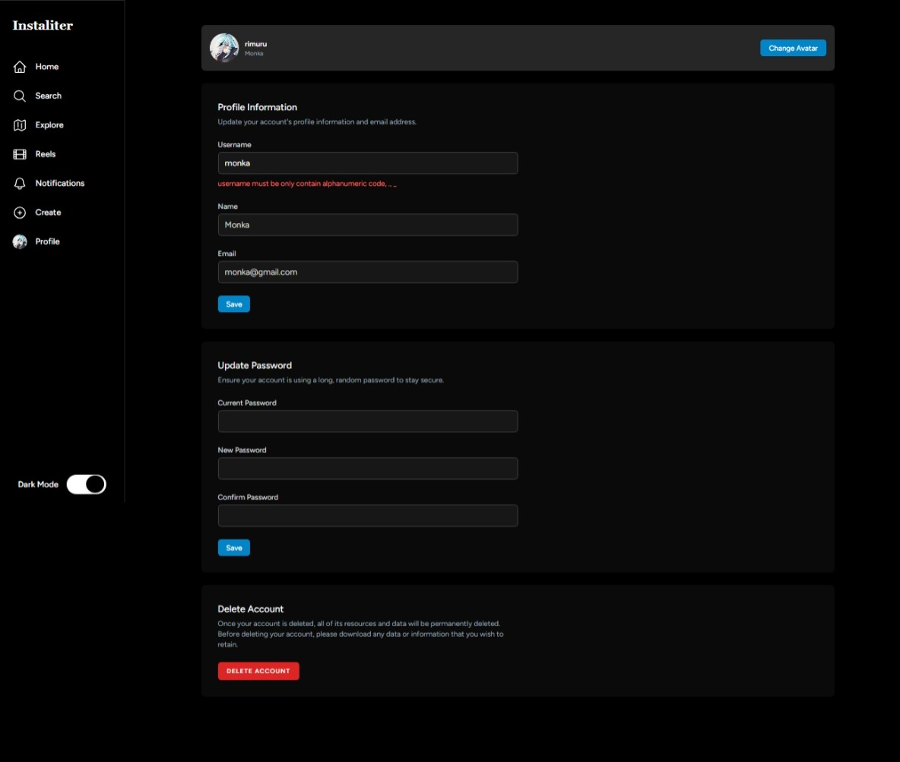

# Instaliter (Instagram Clone)

>A clone of Instagram web with React.js, Inertia.js and Laravel


## Features

<ul>
    <li>
        Register, Login, logout<br>
        
        
    </li>
    <li>
        Change profile picture, name, username, email and delete account<br>
        
    </li>
    <li>
        Create and Delete Post<br>
        
    </li>
    <li>
        Edit image and caption Post<br>
        
    </li>
    <li>
        Add and delete comment<br>
        
    </li>
    <li>
        Dark Mode<br>
        
        
    </li>
</ul>


## App Setup

```
git clone https://github.com/bsrmdn/instaliter.git

composer install 

cp .env.example .env 

php artisan cache:clear 

composer dump-autoload 

php artisan key:generate

composer require laravel/breeze --dev

php artisan breeze:install react --dark

php artisan serve
```
Create the DB
```
DB_CONNECTION=mysql
DB_HOST=127.0.0.1
DB_PORT=3306
DB_DATABASE=instaliter
DB_USERNAME=root
DB_PASSWORD=
```
Now migrate your DB
```
php artisan migrate

```

Now run this command to start the project 
```
npm i

npm run dev
```

You should be good to go!

